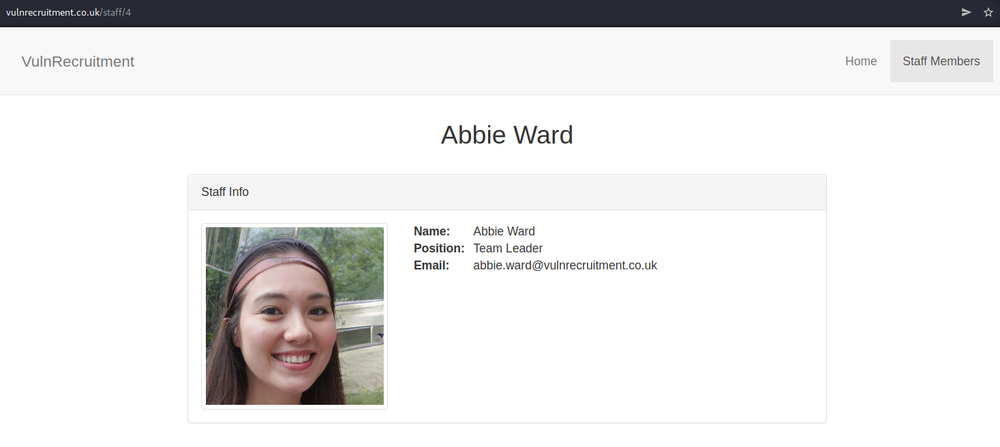
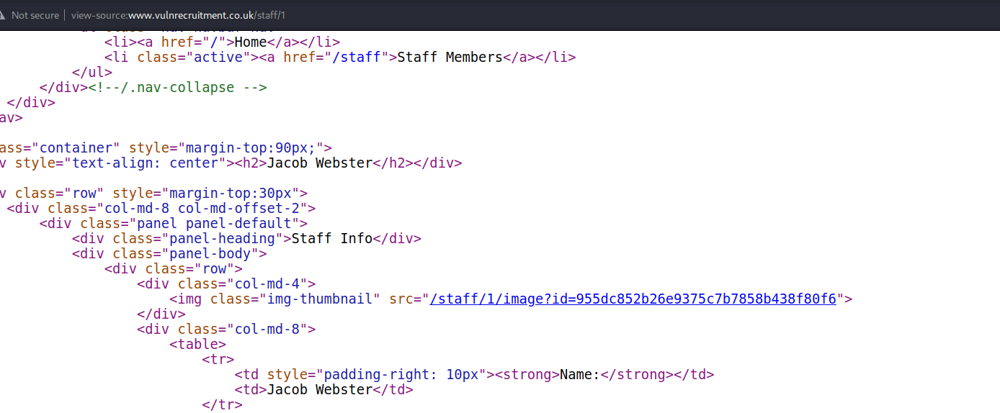
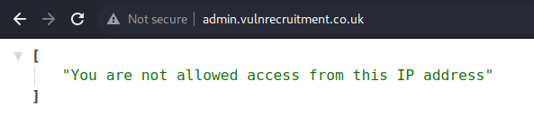
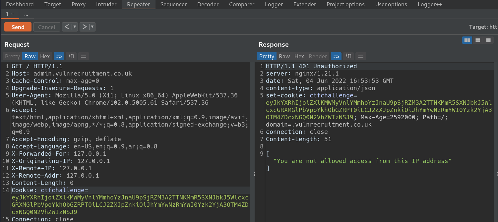
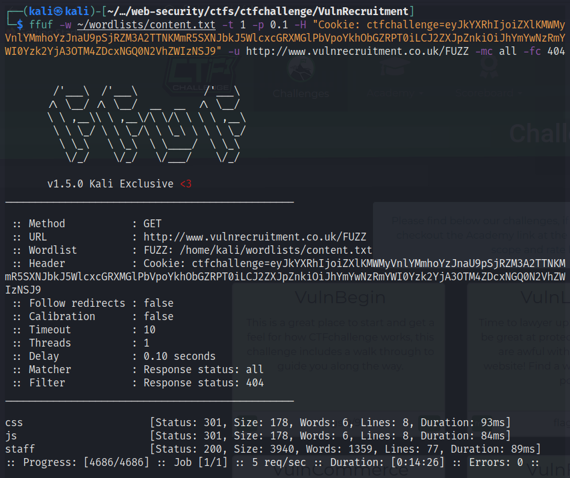
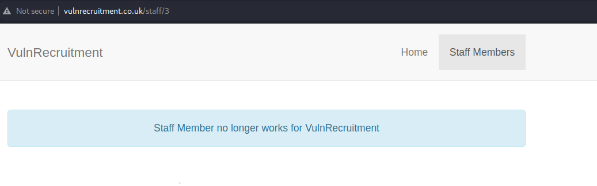
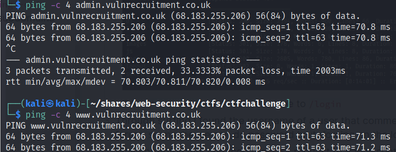
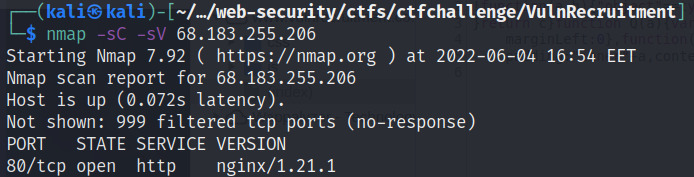
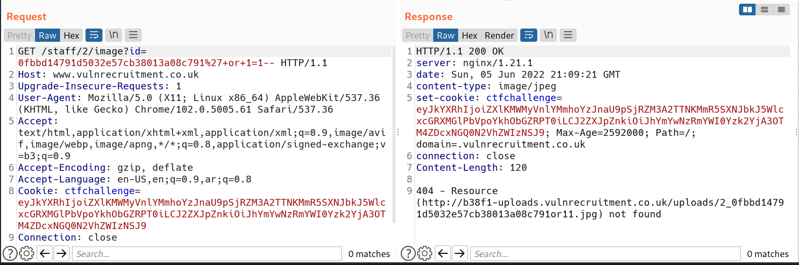
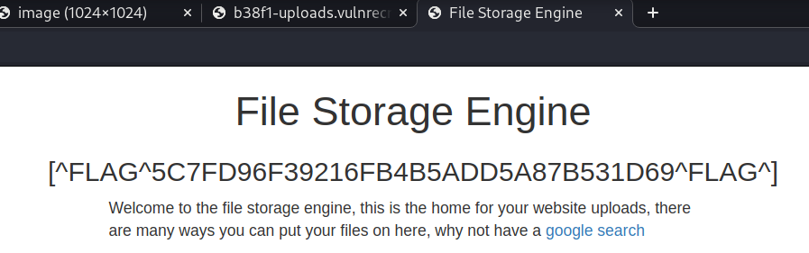

1. First, we started by exploring the main domain [VulnRecruitment](http://www.vulnrecruitment.co.uk/) and we only found this
	1. `/staff` URL that only shows the email of every staff member. 
	2. Also, found that every image has an ID 
2. Subdomain discovery
	- Using dnsrecon: `dnsrecon -d vulnrecruitment.co.uk -D ~/wordlists/subdomains.txt -t brt`
		- Resulted in `A admin.vulnrecruitment.co.uk 68.183.255.206`
	- Searching on [crt.sh](https://crt.sh)
		- Nothing found
3. Investigated this [admin interface](http://admin.vulnrecruitment.co.uk/) and found that it is not accessible from my IP address 
4. `nmap`ed the *TCP* ports using `nmap -sC -sV 68.183.255.206` and the *UDP* ports using `sudo nmap -sU 68.183.255.206` of the IP address but found nothing of interest
5. It seems that the IP is blocked by a WAF, so maybe we can bypass it by adding some headers *(X-Forwarded-For, X-Originating-IP, X-Remote-IP, X-Remote-Addr)*? **No**
6. Content discovery on [www.vulnrecruitment.co.uk](http://www.vulnrecruitment.co.uk/)
	- Only found `/staff` 
7. While discovering this `staff/1`, `staff/2`, etc.. I tried `staff/3` and this showed  So there must be something to do with this member
8. Going back to `admin.vulnrecruitment.co.uk`, I tried to `ping -c 4 www.vulnrecruitment.co.uk` and it turned out that the 2 subdomains are hosted on the same server  **This may be a [HTTP Host Header Attack](https://portswigger.net/web-security/host-header)??** *No*
9. Going back to the `nmap` of the server, the *TCP* mapping showed the version of the running web server  So this may have a disclosed vulnerability? **It seems not**
10. Tried finding a SQL injection vulnerability in the `/staff/{staff_id}/image?id={id}` and found this response 
	11. Visited [b38f1-uploads.vulnrecruitment.co.uk](http://b38f1-uploads.vulnrecruitment.co.uk/) and found that it is file storage engine of the domain  *Found Flag 1*