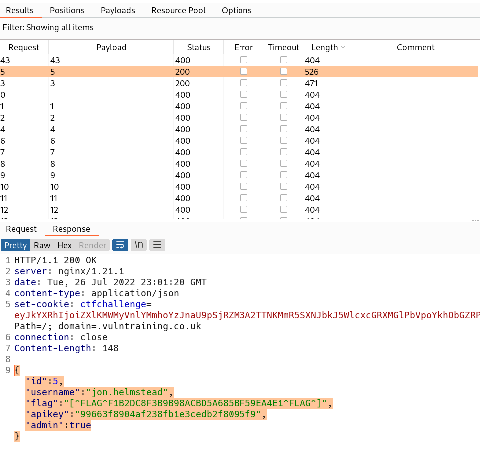

# Intro
On the website [ctfchallenge.com](https://ctfchallenge.com), the definition of this challenge is as follows
>VulnTraining provide training services to their clients but they could do with some training themselves, security training that is!

**CTF level**: hard.  
**Number of flags**: 11  
**Main website**: [www.vulntraining.co.uk](http://www.vulntraining.co.uk/)    
**Screenshot**:   
# Things of Value
Here, we add anything we find of value incrementally during our walk through.
## Subdomains
1. billing.vulntraining.co.uk *found from subdomain discovery in step 2*
2. c867fc3a.vulntraining.co.uk *found from subdomain discovery in step 2*
## Endpoints
1. billing.vulntraining.co.uk/login -> *found from subdomain discovery in step 2*
	1. billing.vulntraining.co.uk/?api=test -> *found from parameter discovery in step 14*
2. www.vulntraining.co.uk/
	1. www.vulntraining.co.uk/git/HEAD -> *found from content discovery in step 5*
	2. www.vulntraining.co.uk/.git/config -> *found from content discovery in step 5*
	3. www.vulntraining.co.uk/.git/index -> *found from content discovery in step 5*
	4. www.vulntraining.co.uk/framework -> *found from content discovery in step 5*
	5. www.vulntraining.co.uk/robots.txt -> *found from content discovery in step 5*
	6. www.vulntraining.co.uk/server/ -> *found from content discovery in step 5*
	7. www.vulntraining.co.uk/server/login -> *was directed to it through a location header*
3. vulntraining.co.uk/php-my-s3cret-admin -> *found from endpoint 7*
4. admin.vulntraining.co.uk/ -> *found after subdomain discovery in step 12*
	1. admin.vulntraining.co.uk/admin
		1. admin.vulntraining.co.uk/admin/users
	2. admin.vulntraining.co.uk/invoices
## Credentials
1. Database creds: `vulntraining:#x7QE1Jg&cNO`
2. Billing account creds: `dominic.bryant:987654321`

# Walk Through
1. We usually start by surfing the website but in the case of this website it is really simple, just the home page and not a single link other than it.
2. So we do some subdomain discovery by
	1. Using *dnsrecon*: `dnsrecon -d vulntraining.co.uk -D ~/wordlists/subdomains.txt -t brt` but **0 records found**
	2. Searching on [crt.sh](https://crt.sh/?q=vulntraining.co.uk) we found
		1. `billing.vulntraining.co.uk`
		2. `c867fc3a.vulntraining.co.uk`    
3. Had a quick look at each one of these subdomains. Found that
	1. `c867fc3a.vulntraining.co.uk` showed a flag          **Found Flag 1**
	3. `billing.vulntraining.co.uk` showed a login forum   
4. We can start by entering any data in username and password fields to see how the website reacts with it and it showed the error message `Username is invalid`      So we can enumerate usernames
	1. Username enumeration using **ffuf**: `ffuf -w ~/wordlists/usernames.txt -X POST -d "username=FUZZ&password=werwe" -t 1 -p 0.1 -H "Cookie: ctfchallenge=$ctfchallenge_cookie" -H "Content-Type: application/x-www-form-urlencoded" -u http://billing.vulntraining.co.uk/login -mc all -fr "Username is invalid"` but **no username in this list is valid** so we have to find usernames in another way
5. We try discovering any hidden endpoint in `www.vulntraining.co.uk` by bruteforcing it with *ffuf*: `ffuf -w ~/wordlists/content.txt -t 1 -p 0.1  -H "Cookie: ctfchallenge=$ctfchallenge_cookie" -u http://www.vulntraining.co.uk/FUZZ -mc all -fc 404` and found `.git` files and some endpoints   
	1. We start with the simplest `robots.txt` endpoint and we find that it has a disallowed directory that when accessed showed **flag 2**         **Found Flag 2**
	2. Then we try accessing this `/server` endpoint that shows `302 status code` which is a relocation, but is showed a snapshot of the server status!      **Found Flag 4**
	3. We go and visit the admin site of MySQL `http://vulntraining.co.uk/php-my-s3cret-admin` to see what it has and it has a PHPMyAdmin panel!   
	4. Tried entering a random username and password to see if we can bruteforce usernames, but it shows a general error message -> `Invalid username and password combination`
6. Going back to the `.git` files we found, I accessed `.git/config` file and found that it had a remote git repository! 
	1. We visited this remote repo and found that it is the framework used in the main website and it was private but they had open it to the public      **Found Flag 6**
	2. Looking at the commits, it has a commit with a message `Removed database creds now we're making this project open source`! We found database credentials `vulntraining:#x7QE1Jg&cNO`!   
7. Going back to the PHPMyAdmin page we found earlier in *step 5.3*, we try found credentials and it works     
	1. We access this `vulntraining` database and we find `billing_users` table that has a user with a probably hashed password!     **Found Flag 7**
	2. This password seems to be hashed but not showing completely, so we can bruteforce with the username we got, `dominic.bryant` by **ffuf**:
		1. `ffuf -w ~/wordlists/passwords.txt -X POST -d "username=dominic.bryant&password=FUZZ" -t 2 -p 0.1 -H "Cookie: ctfchallenge=$ctfchallenge_cookie" -H "Content-Type: application/x-www-form-urlencoded" -u http://billing.vulntraining.co.uk/login  -mc all -fr "Password is invalid"`
		2. Voila! We found the password which is `987654321`   
8. While reviewing the requests in Burp Proxy history *(a step I do often every now and then during the pentesting process)*, I found that the main website `www.vulntraining.co.uk` has a flag in its response in the HTML `<meta>` tag!     **Found Flag 5**
9. We now login in the `billing.vulntraining.co.uk/login` forum with the credentials `dominic.bryant:987654321`      **Found Flag 8**
	1. We find that every Id is a hyperlink to an invoice, so I tried different Ids like `billing.vulntraining.co.uk/10` but it showed a `404 status code`
	2. So maybe we can do content discovery using **ffuf** but found nothing other than the Ids of the 4 invoices and the `/login` and `/logout` endpoints but only sat the `token` cookie with `deleted`
	3. Tried content discovery on `billing.vulntraining.co.uk/1/FUZZ` but nothing appeared   
10. I went back to surfing the original domain and found that it has `style.css` file under `http://www.vulntraining.co.uk/css` so I went to look for the content of this file and found a hidden asset!   
	1. I visited this domain and found it to be an AWS Bucket that hosts the background image and a `flag.txt` file!   
	2. Visited this file and found the flag       **Found Flag 3**
11. We try doing content discovery on `http://www.vulntraining.co.uk/server/` using **ffuf** but only the `/login` endpoint appeared!
12. I went back for doing some subdomain discovery on `vulntraining.co.uk` because maybe I have missed something and as I hoped, we found `admin.vulntraining.co.uk` subdomain   
13. We try with this `admin.vulntraining.co.uk` subdomain and it is an API that shows a response `Unauthorized`! So we can do content discovery
	1. Doing content discovery, we found 2 endpoints: `/admin` and `/invoices`   
	2. I recursively did content discovery on `/admin` and found `/admin/users/` under it but it was also `unauthorized`, so maybe we're going in the wrong way
14. We go back to `billing.vulntraining.co.uk`, it shows a comment in HTML saying `API Response Time 0`, so we know for sure that this is an *api*. But from *step 9.1* we know that it has no endpoints other than that of `/1`, `/2`, `/3`, `/4`, so can we do parameter discovery?        and found a parameter showing `500 status code` which indicates an internal server error. This seems interesting    
	1. We see what kind of error it shows, so I tried setting this `api` get parameter to  `test` and it only showed `API Error` message!    
	2. Tried multiple values for this `api` parameter like `api=internal`, `api=external` and such but nothing worked
	3. Tried parameter bruteforcing on `http://admin.vulntraining.co.uk/admin/?FUZZ=test` but nothing happened
	4. Tried content discovery on `http://admin.vulntraining.co.uk/admin/users/FUZZ` and it showed that any integer that follows `/users/` such as `/users/10001` would give a `401 Status Code` response
	5. Tried writing a URL in that *api* parameter and it shows the original pages of `billing.vulntraining.co.uk` when `api=admin.vulntraining.co.uk` and shows `API Error` when `api=billing.vulntraining.co.uk`   
	6. This indicates that `billing.vulntraining.co.uk` communicates with `admin.vulntraining.co.uk`, so maybe we can see how this communication works by generating a burp collaborator link and see if its response shows. YAAAAYYY! we find a **flag** and a **token** (probably the admin token)        **Found Flag 9**
15. Tried this **X-Token** HTTP header to see if this authorizes the request to the api `http://admin.vulntraining.co.uk/` and it worked!   
	1. From *step 13.1*, we know that `admin.vulntraining.co.uk` has `/admin/users/` endpoint so we must try it. Unfortunately, it shows that user does not have the permission   
	2. We can try `/admin/users/1` for example hoping that this *api* has [Broken Function Level Authorization](https://github.com/OWASP/API-Security/blob/master/2019/en/src/0xa5-broken-function-level-authorization.md) vulnerability, and it actually has!   
	3. We then do bruteforcing on this `/admin/users/{id}` endpoint to enumerate user ids using Burp Intruder and we found the **admin** user to have `id=5` and `username=jon.helmstead`!       **Found Flag 10**
	4. We try accessing this `/admin` endpoint with the new `apikey` we found and see what appears. We find a secret endpoint    
	5. We access this secret endpoint but it only redirected my to another endpoint with no value   
	6. Tried changing this `id` parameter but it only showed `Message is deleted` when `id=1` and `Message not found` when I changed the `id` to any other value
16. Tried to login with `jon.helmstead` to `http://billing.vulntraining.co.uk/login` but it says that `Username is invalid` so this user is not on `billing` subdomain
17. Then I bruteforce the password of `jon.helmstead` username *(with the large passwords file)* in the `http://www.vulntrainging.co.uk/server/login`, but found no password matching
	1. I tried SQLi with this `id` parameter thinking that this message with `id=1` might have a flag `deleted=1`, so I wrote in the query `/admin/s3cr3t_m3ss4g3s/?id=1%20AND%20deleted%3d1` and it showed the same response as `/admin/s3cr3t_m3ss4g3s/?id=1` so I think it is vulnerable to SQL injection   
	2. 